<p align="center"><a href="https://rima.sc.inko.cloud/" target="_blank" rel="noopener noreferrer">
</a></p>

# RIMA

A transparent Recommendation and Interest Modeling Application. Developed by Social Computer Group at the University of Duisburg-Essen

## Project title
Improving the interactive visualization of the "Explore"-Page to reach the self-actualization goal "Explore".

### Short description
This project is about improving the transparent Recommendation and Interest Modeling Application, short RIMA, to make the user reach self-actualization through supporting various self-actualization goals. We aim to improve the experience of the self-actualization goal "Explore" by making the "Explore"-Page more appealing to use, give more options of interaction and adjusting the systems interests model, and have more accurate recommendations. In reference to our research question: "How can the page "Explore" be improved to reach the self-actualization goal "Explore"?", we developed various improvements to make the user reach this goal.

### Project Architecture
The "Explore"-Page comprises three main files. "Explore.jsx" is responsible for the grid layout where "Explore"-Page elements are positioned. "GetNodeLinkExplore.jsx" generates the "Explore"-graph. "explore.py" generates interests, which are subsequently sent to the frontend and displayed within the node-link diagram.

Our group has introduced eight improvements to the system, which are distributed among these files. Six of them are directly related to the graph and have been implemented in "GetNodeLinkExplore.jsx". Within this module, we can also distinguish the "getElements" function, which appropriately structures the data from the backend for display in the "Explore"-graph. This function has been extended and used to actualize three of our improvements. Additionally, we have introduced a new element to the existing grid layout, partially implemented in the "Explore.jsx" file. Furthermore, we have incorporated a new layer of interests using the 'explore.py' file for this purpose.

The following venn diagram illustrates the files in which respective improvements were implemented:
<p align="center">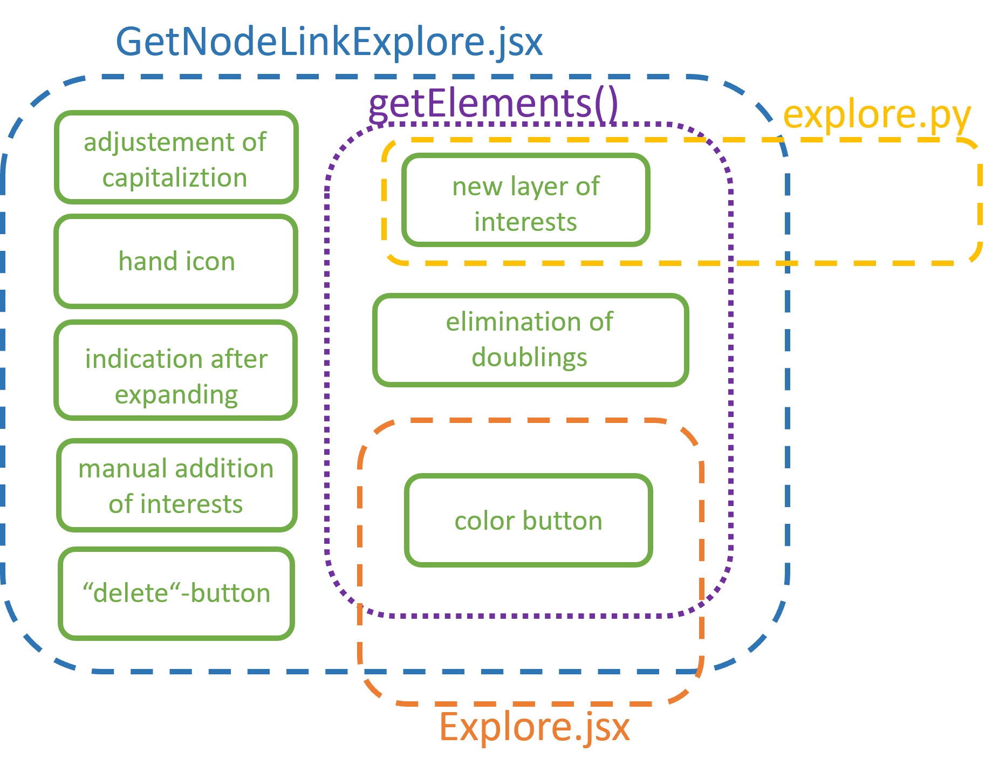</p>

### Libraries
<ul>
  
  <li>
    <a href="https://github.com/cytoscape/cytoscape.js">Cytoscape.js</a>
  </li>
  
  <li>
    <a href="https://github.com/mui/material-ui">Material UI</a>
  </li>
</ul>

### Screenshots
<h4 align="center">Introduced improvements</h4>

<p align="center">From left: adjustment of readability, hand icon, indication after "Expand"</p>
<div align="center">
    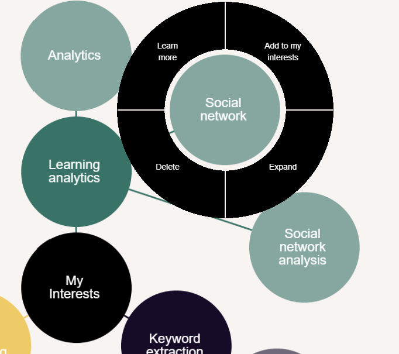
    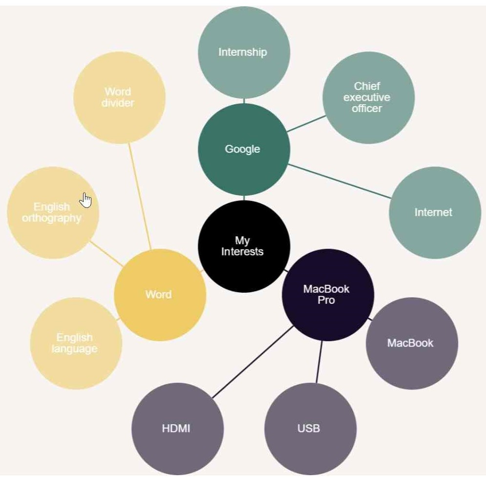
    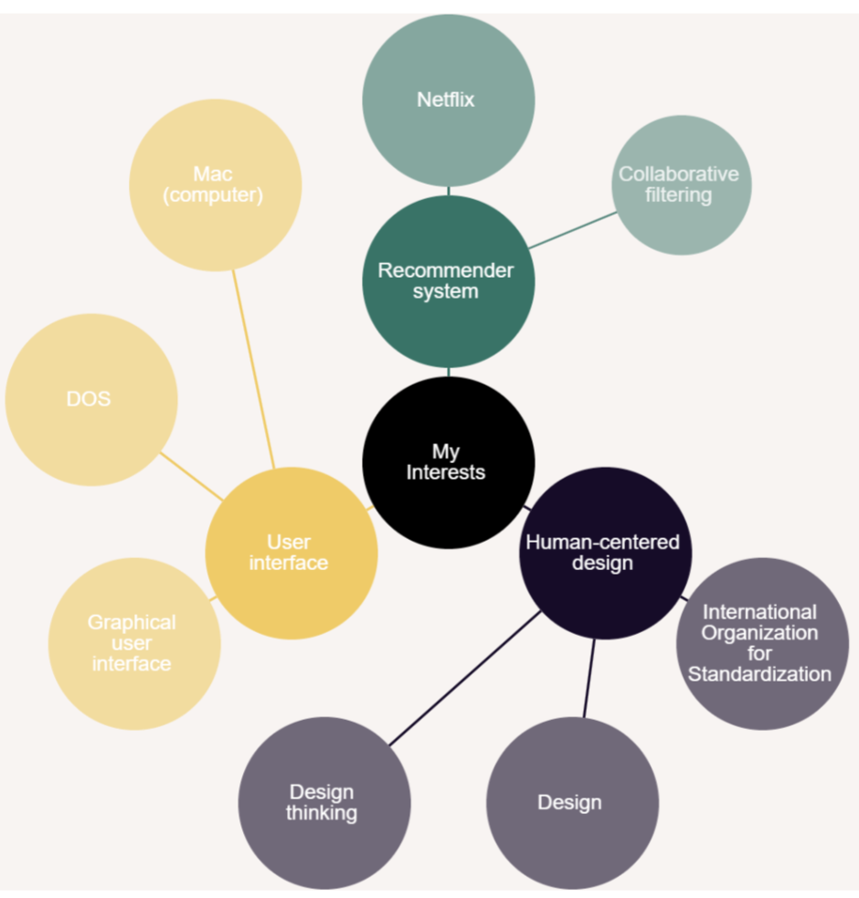
</div>

<br />
<br />
<br />

<p align="center">Manual addition of interests</p>
<div align="center">
    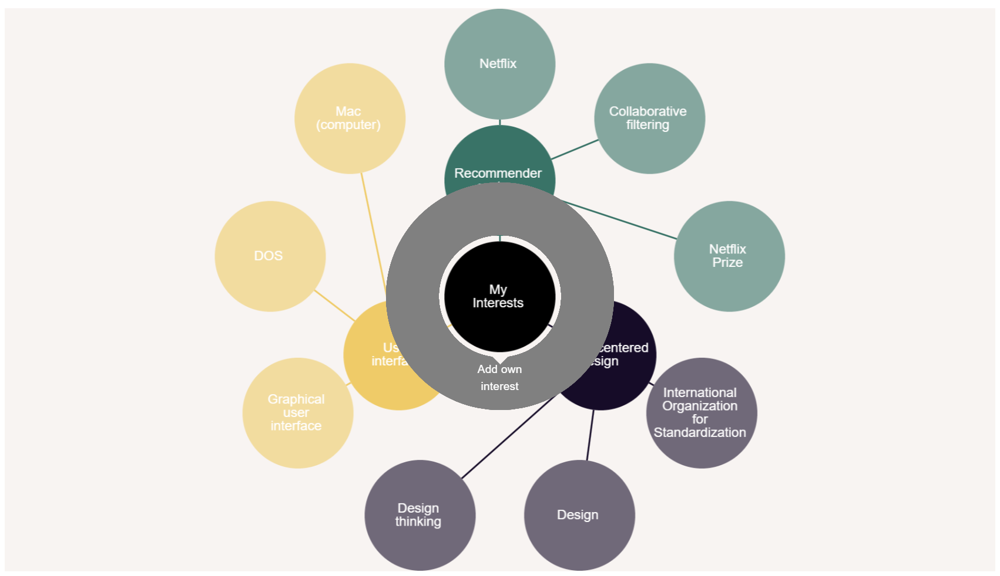
</div>
<div align="center">
  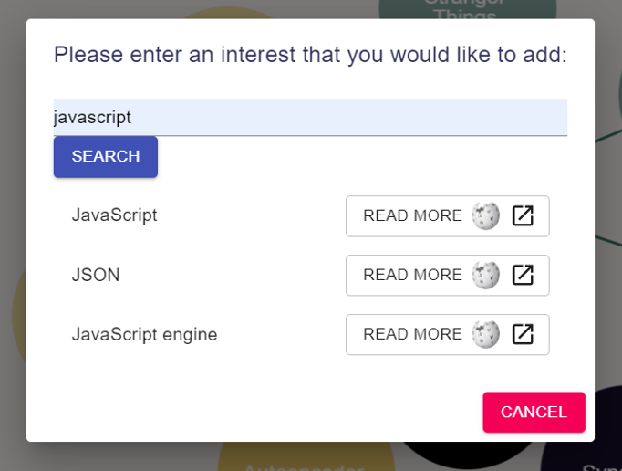
  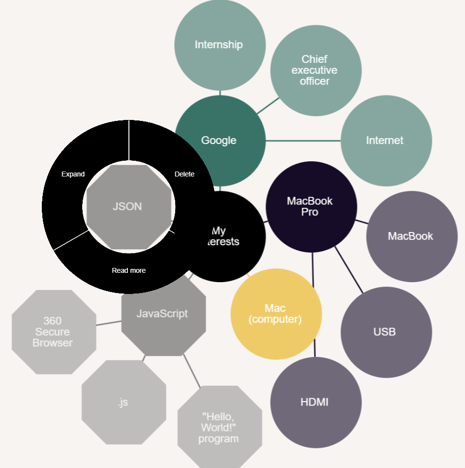
</div>

<br />
<br />
<br />

<p align="center">"Delete"-button</p>
<div align="center">
    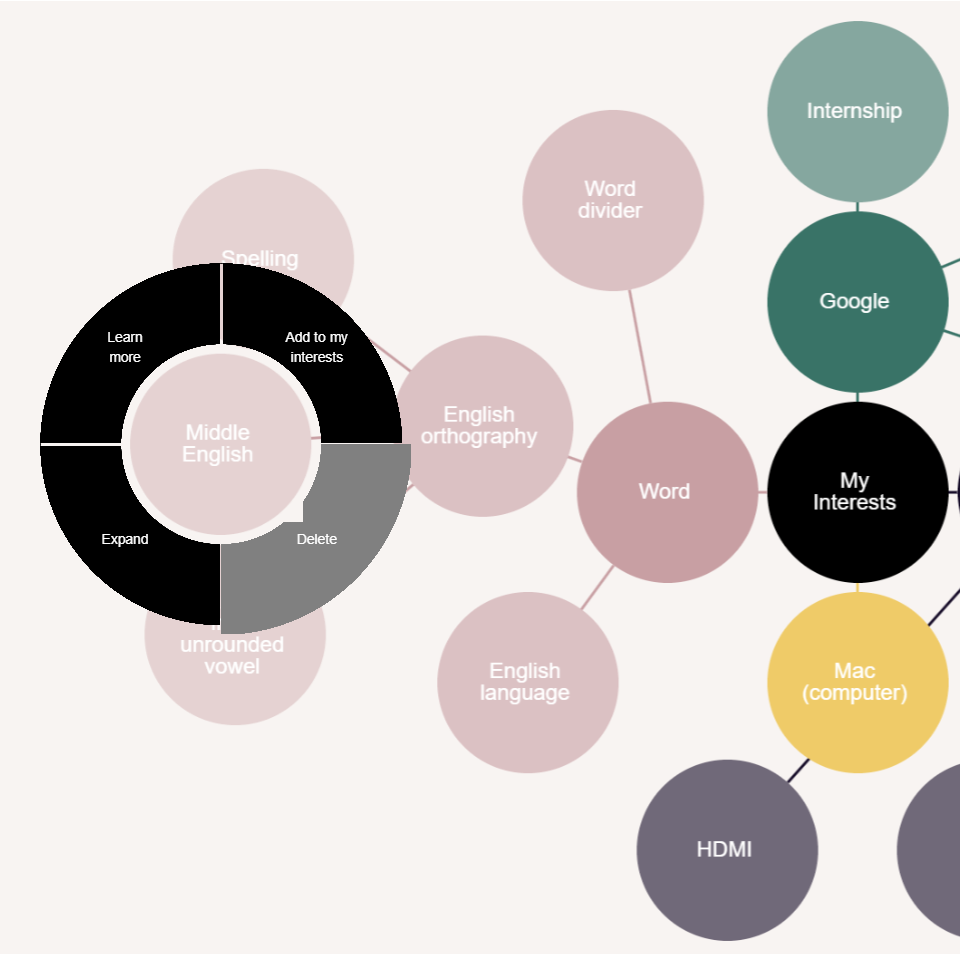
    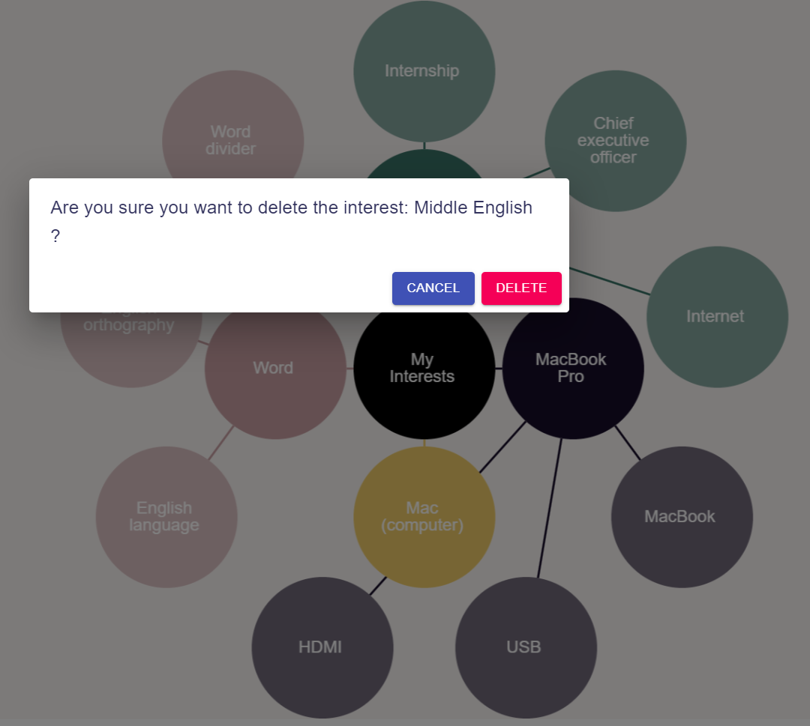
</div>

<br />
<br />
<br />

<p align="center">Elimination of doubled interests in the graph</p>
<p align="center">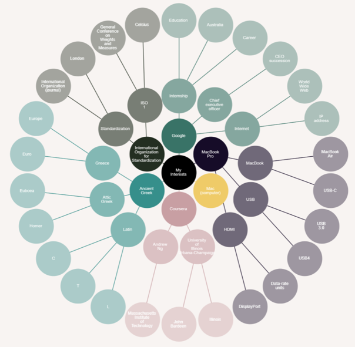</p>

<br />
<br />
<br />

<p align="center">Incorporation of button which enables to change color of nodes</p>
<p align="center">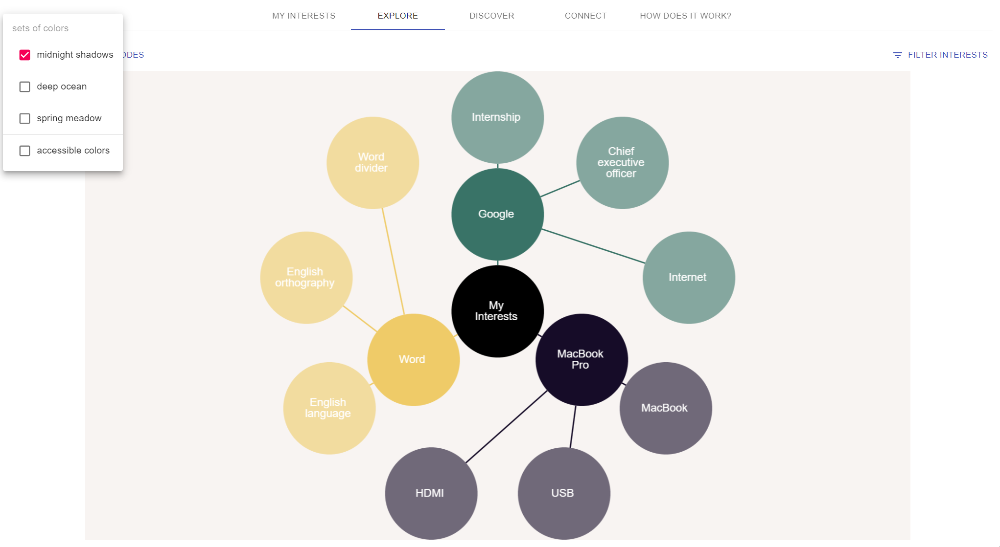</p>

<div align="center">
    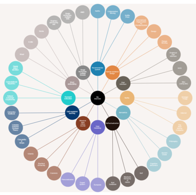
    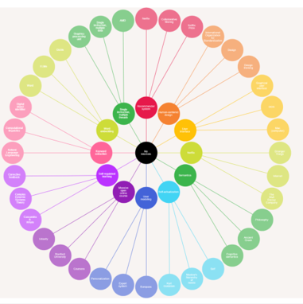
    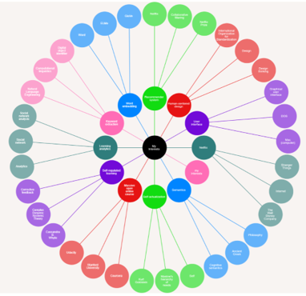
</div>

<br />
<br />
<br />

<p align="center">Additional layer of interests</p>
<p align="center">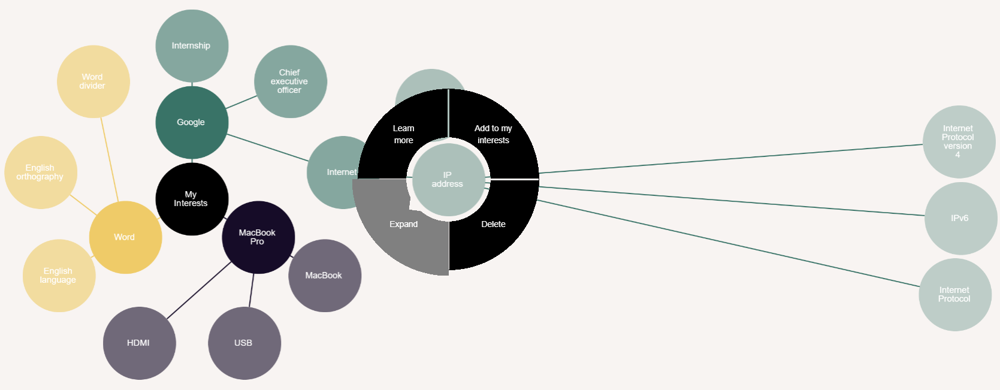</p>

### Group Members
Project realized by Mateusz Cygan, Pia Dungs and Serkan Topal.

## Installation

### Manual Installation Guide

#### Step 1: Installation Guide for RIMA-Backend

1. Download Python (v3.7.1) from [the official website](https://www.python.org/downloads/release/python-371/)

2. Download [IntelliJ Ultimate](https://www.jetbrains.com/de-de/idea/download/#section=windows) or [Visual Studio Code](https://code.visualstudio.com/download) and install one of the code editors

3. Install and activate python virtual environment for Windows

   - Open a command prompt with **administration rights**

   - Move to the directory `RIMA-Backend` in your command prompt

   - Type the following commands to install and activate the virtual environment:

     - Install python virtual environment

       ```
       pip install pipenv
       ```

       For Mac/Linux users follow the instructions here: [Pipenv Installation](https://pipenv-fork.readthedocs.io/en/latest/install.html#installing-pipenv)

     - Install python package

       ```
       pipenv install
       ```

     - Activate the virtual environment

       ```
       pipenv shell
       ```

       (Optional) To check the location of your virtual environment, type the following command in your command prompt

       ```
       pipenv --venv
       ```

   - Download the spacy package

     ```
     python -m spacy download en
     ```

   - Download the necessary nltk packages

     ```
     python -c "import nltk;nltk.download('stopwords'); nltk.download('punkt'); nltk.download('sentiwordnet')"
     ```

4. Using your file explorer, go inside the directory `RIMA-Backend\config`, copy the twitter config file `rename_twitter_config.yaml` and paste it in the same folder. Rename the copied twitter config file to `twitter_config.yaml`

   - (Optional) Make an account on [Twitter Developer Platform](https://developer.twitter.com/en) and copy the necessary API keys and access tokens in the `twitter_config.yaml` file

5. Install [Visual Studio Community 2017](https://visualstudio.microsoft.com/de/thank-you-downloading-visual-studio/?sku=Community&rel=15). Make sure to install the package `Desktop development with C++`. Set `VCINSTALLER` system variable to `C:\Program Files (x86)\Microsoft Visual Studio\2017\Community\VC` ([Read more](https://stackoverflow.com/questions/57541402/node-gyp-configure-got-gyp-err-find-vs/70799513#70799513)). For Linux users, check [GCC Installation guide for Linux](https://linuxize.com/post/how-to-install-gcc-compiler-on-ubuntu-18-04/)

6. Download and install [Redis for Windows](https://github.com/MicrosoftArchive/redis/releases/download/win-3.2.100/Redis-x64-3.2.100.msi)

7. Download [Elmo](https://s3-us-west-2.amazonaws.com/allennlp/models/elmo/2x4096_512_2048cnn_2xhighway/elmo_2x4096_512_2048cnn_2xhighway_weights.hdf5) and copy it inside `RIMA-Backend/interests/Keyword_Extractor/Algorithms/embedding_based/auxiliary_data`

8. Download [StanfordCoreNLP](http://nlp.stanford.edu/software/stanford-corenlp-full-2018-02-27.zip) and extract the ZIP file inside `RIMA-Backend/interests/Keyword_Extractor/Algorithms/embedding_based`

9. Download [MSmarco model](https://1drv.ms/u/s!AokEy2_vaKbhgddabiUyea8NDznodA?e=NwX2CR). Create a folder named "transformers" in "RIMA-Backend" folder. Unzip the downloaded file and save it in the location `RIMA-Backend/transformers`

10. Download and install [Java JDK](https://www.oracle.com/java/technologies/downloads/)

11. Download the [GloVe model](https://drive.google.com/file/d/1FfQgEjR6q1NyFsD_-kOdBCHMXB2QmNxN/view?usp=sharing) and copy the model inside the `RIMA-Backend`

12. In the command prompt to create the database

    ```
    python manage.py migrate
    ```

13. Run the django server and do not close it

    ```
    python manage.py runserver
    ```

14. Open a new command prompt with admin rights or terminal

    - Move to the `RIMA-Backend` in your command prompt

    - Activate the virtual environment

      ```
      pipenv shell
      ```

    - Start the celery workers and do not close the command prompt

      ```
      celery worker --app=interest_miner_api -l info -P eventlet
      ```

#### Step 2: Installation Guide for RIMA-Frontend

1. Download Node.js (v12.13.0) from [the official website](https://nodejs.org/en/blog/release/v12.13.0)

2. Using your file explorer, go inside the directory `RIMA-Frontend/nodejs`, copy the `example.env` file and paste it in the same folder. Rename the copied environment file to `.env`

3. Open a command prompt/terminal in the `RIMA-Frontend/nodejs` directory

4. Type the command in the command prompt/terminal to install node packages

    ```bash
    npm ci
    ```

    If you face issue with `npm ci` command, try `npm install` or `npm install --force` command. Caution: `npm install` and `npm install --force` will delete all the existing node packages, install the new ones and update the `package-lock.json` file. Please make sure you DO NOT push your changes to the `package-lock.json` file.

5. After the packages are installed, type the following command to run the server

    ```bash
    npm start
    ```

    The server will run at [http://localhost:8080](http://localhost:8080)

6. Stop the server by pressing `Cntl + c` inside the command prompt

### 🐳 Docker Installation Guide (Outdated)

1. Download and install [Docker](https://www.docker.com/products/docker-desktop)

2. Download [Elmo](https://s3-us-west-2.amazonaws.com/allennlp/models/elmo/2x4096_512_2048cnn_2xhighway/elmo_2x4096_512_2048cnn_2xhighway_weights.hdf5) and copy it inside `RIMA-Backend/interests/Keyword_Extractor/Algorithms/embedding_based/auxiliary_data`

3. Download [StanfordCoreNLP](https://uni-duisburg-essen.sciebo.de/s/jADBrM5PUgVqMIr/download) and unzip the file inside `RIMA-Backend/interests/Keyword_Extractor/Algorithms/embedding_based`

4. Download [MSmarco model](https://uni-duisburg-essen.sciebo.de/s/z1k3w8Oxb8RRd4M/download). Create a folder named "transformers" in "RIMA-Backend" folder. Unzip the downloaded file and save it in `RIMA-Backend/transformers`

5. Download the [GloVe model](https://uni-duisburg-essen.sciebo.de/s/cKZLWBtulWHoCaT/download) and unzip the model inside the `RIMA-Backend` folder

6. Using your file explorer, go inside the directory `RIMA-Backend\config`, copy the twitter config file `rename_twitter_config.yaml` and paste it in the same folder. Rename the copied twitter config file to `twitter_config.yaml`

7. Make an account on [Twitter Developer Platform](https://developer.twitter.com/en) and copy the necessary API keys and access tokens in the `twitter_config.yaml` file

8. Download and install [Node.js ver.12.13.0](https://nodejs.org/dist/v12.13.0). Using a terminal/command prompt, move to the `RIMA-Frontend/nodejs` and type `npm install`

9. In the `RIMA-Frontend\nodejs` folder, rename the environment variable file from `.env.example` to `.env`

10. Run the following command in the root directory `RIMA`

    ```
    docker-compose -f docker-compose-dev-alp.yml up --build
    ```

**FAQ**

Q. My the interest model is not working, what should I do?

A. Delete the python virtual environment, db.sqllite3 file inside RIMA-Backend folder, and repeat the whole process from the beginning. Make sure you install the python virtual environment, python packages, and run the servers in Command Prompt with Administration rights.

#### Step 2: Installation Guide for RIMA-Frontend

1. Download and install [Node.js ver.12.13.0](https://nodejs.org/dist/v12.13.0)

2. Using a file explorer, move to the `RIMA-Frontend/nodejs` and rename the `.env.example` file to `.env`

3. Open a command prompt or terminal and move to the `RIMA-Frontend/nodejs` directory

4. Type `npm install` to install the necessary dependencies for the project

5. Type `npm start` to run the project

6. [http://localhost:3000](http://localhost:3000/) will open in a browser

## Components

- RIMA-Backend
  - api: Django (Python) HTTP api, serving ...
  - worker: Celery (Python) job queue, doing ...
  - db: PostgreSQL database, used for ...
  - redis: Redis key-value cache, used for ...
- RIMA-Frontend
  - web: User-facing React (Node.js) UI, offering ...
- model:
  - downloader: Bash, fetches GloVe model from Google Drive
  - server: nginx, serves GloVe model to RIMA-Backend via HTTP

## Official builds and deployments

### Container images

- [RIMA-Backend](https://hub.docker.com/repository/docker/inko/soco-rima-backend)
- [RIMA-Frontend](https://hub.docker.com/repository/docker/inko/soco-rima-frontend)
- [model-downloader](https://hub.docker.com/repository/docker/inko/soco-rima-model-downloader)

### Live deployments

- [Production](https://rima.sc.inko.cloud/) (tagged versions)
- [Development](https://rima-dev.sc.inko.cloud/)
- [Branch dev-alp](https://rima-dev-alp.sc.inko.cloud/)

## Run on Docker

- Production: `docker-compose up -f docker-compose.yml` (see `Makefile`)
- Development: `tilt up`

## Run on Kubernetes

- see `./.k8s/README.md`

## Development setup

- see `./RIMA-Backend/README.md` and `./RIMA-Frontend/README.md`

## Citations

- (Bibtex)

## Contributing
